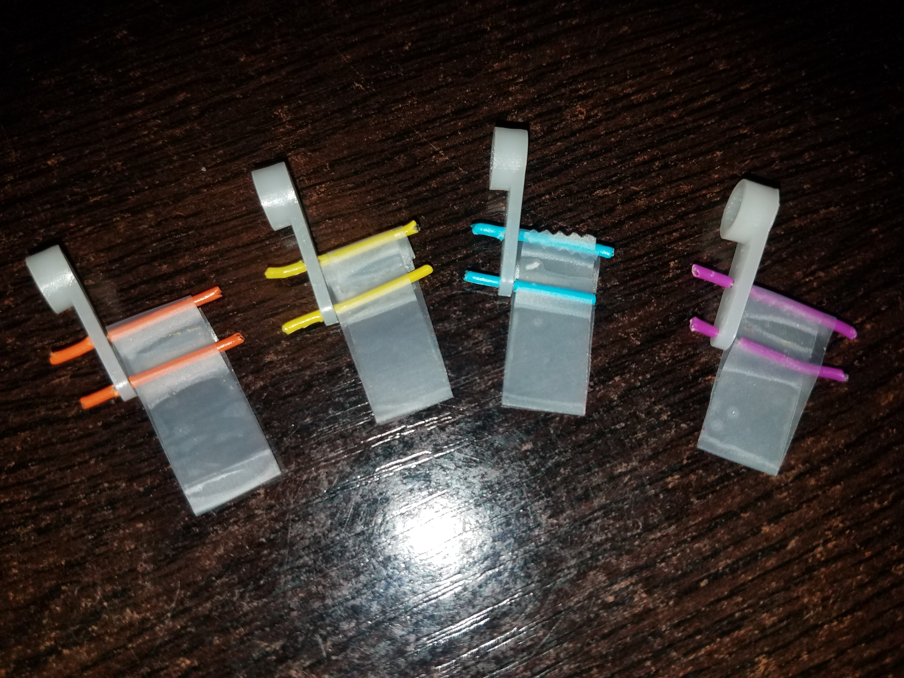

<!-- PROJECT SHIELDS -->
[![LinkedIn][linkedin-shield]][linkedin-url]
[![Arduino-IDE][arduino-shield]][arduino-url]
[![Cpp][cpp-shield]][cpp-url]

<!-- PROJECT LOGO -->
 

  

  <h1 align="center"><i>Dextera ("Right Hand")</i></h1>

  

    An electronic live performance sound art piece 🎸
     
    <a href="https://github.com/PaulCaroline/MUSC075_Final_Project"><strong>Explore the docs »</strong></a>
     
     
    <a href="https://github.com/PaulCaroline/MUSC075_Final_Project">View Demo</a>
    ·
    <a href="https://github.com/PaulCaroline/MUSC075_Final_Project/issues">Report Bug</a>
    ·
    <a href="https://github.com/PaulCaroline/MUSC075_Final_Project/issues">Request Feature</a>
  

<!-- TABLE OF CONTENTS -->

  
Table of Contents

  <ol>
    <li>
      <a href="#overview">Overview</a>
      <ul>
      </ul>
    </li>
    <li>
      <a href="#procedure">Procedure</a>
      <ul>
        <li><a href="#materials">Tools & Materials</a></li>
        <li><a href="#schematic">Hardware & Schematics</a></li>
        <li><a href="#testing">Construction & Testing</a></li>
      </ul>
    </li>
    <li><a href="#usage">Demo</a></li>
    <li><a href="#contributing">Contributing</a></li>
    <li><a href="#license">License</a></li>
    <li><a href="#contact">Contact</a></li>
    <li><a href="#acknowledgements">Acknowledgements</a></li>
  </ol>

<!-- ABOUT THE PROJECT -->
## Overview

</img>  

*Dextera* is meant to symbolize the synergy of man and machine in the production of music, art, and other related endeavors that probe the limits of human creativity. The piece features a series of touch-sensitive sensors connected to servo motors, which are fitted to plastic picks that each pluck the string of a ukulele when a sensor is triggered. Having the touch sensors situated beneath the strings of the ukulele means that the device can be strummed automatically as a performer stops a string.

This piece aims to highlight the power of technology as a means to strengthen humanity, as opposed to undermining or supplanting it. The right hand holds a special symbolic power in literature as a means of describing strength, vitality, and preeminence. Hence, the arm of the performance artist who wields an instrument such as *Dextera* is strengthened as the might of man and machine interact to create something new and innovative.

This idea is especially pertinent in the context of strummed instruments or "chordophones," like the ukulele, which depend heavily on the cohesiveness of several melodic voices sounding together (as is the case for chords). In this variety of instrument, the sounding of each note can then become an allegory for an act of effective cooperation whereby the oscillation of a string harks back to the amplification of signals by two waves that are in phase. 

The modern age has, in many ways, been revolutionized by automation and computing technologies, and often this has served to take power out of the hands of people while elevating the unguided agents of the Military-Academic-Industrial complex. This project is meant to be a testament to the ideal of using modern innovation to empower people to exercise greater control for the sake of artistry and exacting constructive change. In fact, this work was conceived as an application in the field of prosthetics as a way for a person with a disability to play an instrument while only requiring one hand. It was, in part, inspired by a scene in the Netflix film [*The Perfection*](https://www.netflix.com/title/80211638) during which two cellists perform together on one instrument, each using an opposite hand.

The difference between the illustration offered in the film, and that of a *Dextera* performance lies in the power dynamic. While two parties participate in the performance— the one orchestrating the melody with the left hand, and the other plucking the strings while adding the percussive, syncopated rhythms of a servo motor— the human player takes the lead. As an interpreter of this project, and of the Digital Age, I hope that one would be inclined to highlight the sovereign beauty of the human experience as it is accented by the potential for cybernetic interaction.

<!-- PROCEDURE -->
## Procedure
### Tools & Materials
| Item        | Description |
|-------------|-------------|
|SG90 micro servo (4x) | 5V plastic-geared servo motor w/ 2.5 kg/cm of torque|
|4700 Ω resistors (8X) | 5100 Ω resistors were used, but anything over 1K will suffice|
|Teensy 3.2            | PJRC Microcontroller with native capacitive touch hardware|
|Concert ukulele       | Tuned frequencies: ~392 Hz, ~262 Hz, ~330Hz, ~440 Hz|
|Chassis/ Scaffolding  | Fashioned chassis from a plastic jar and electrical tape|
|Programming  Setup    | Ardiuno IDE via Teensyduino Libray and micro-USB connection|

### Hardware & Schematics
The following circuit diagram was used to construct electrical components of the project inside of a plastic chassis. Please note that the final iteration utilized 5100 Ω resistors.
</img>  

The original draft of the design included a linear wooden or fiberglass scaffolding, but the latest iteration used a hand-crafted plastic, cylindrical chassis, as it proved more expedient given time constraints. Several methods can be employed to mount the servo motors, however.
</img>  

### Construction & Testing
#### Picks
Picks for plucking each string were crafted by threading two pieces of metal wire through the default servo horns, and then attaching a flexible piece of tape in the shape of a flag. 
<table style="padding:10px;">
    <tr>
        <td></img></td>
        <td></img></td>
    </tr>
</table> 

#### Chassis
The chassis containing the mechanical parts of the robot was fashioned from two pieces of plastic that were joined together and fitted with the series of four servo motors via the default screws.
<table style="padding:10px;">
    <tr>
        <td></img></td>
        <td></img></td>
        <td></img></td>
    </tr>
</table>

#### Testing Setup
Testing was done by first achieving the plucking motion on a duplicate set of four servos that were connected to small touch sensors made from copper tape. However, the project might, in fact, be better suited for using the same hardware for testing as well as the final product. There were slight differences in the way the servos responded when programmed. There were also substantial differences between the touch read signals received by the ukulele, and those taken from the test setup. On/Off signal state was managed in the code by setting a threshold value to be the appropriate difference in signal strength for which a touch would be registered.  

<!-- DEMO -->
## Demo
#### *Dextera* in Action

  

<figure>
    <figcaption><strong>Listen to <i>Dextera:</i> </strong></figcaption>
    <audio
        controls
        src="res/audio_trimmed.mp3">
            Your browser does not support the
            <code>audio</code> element.
    </audio>
</figure>

  

Recording available at this [link](https://drive.google.com/file/d/1EbntH5FpYEsRkRXaNc1Gf0LBK3EfbXMq/view?usp=sharing)

#### Gallery
<table style="padding:10px;">
    <tr>
        <td></img></td>
        <td></img></td>
        <td></img></td>
    </tr>
     <tr>
        <td></img></td>
        <td></img></td>
        <td></img></td>
    </tr>
</table>

See the [open issues](https://github.com/PaulCaroline/MUSC075_Final_Project/issues) for a list of proposed features (and known issues).

<!-- CONTRIBUTING -->
## Contributing

Contributions are what make the open source community such an amazing place to be learn, inspire, and create. Any contributions you make are **greatly appreciated**.

1. Fork the Project
2. Create your Feature Branch (`git checkout -b feature/AmazingFeature`)
3. Commit your Changes (`git commit -m 'Add some AmazingFeature'`)
4. Push to the Branch (`git push origin feature/AmazingFeature`)
5. Open a Pull Request

<!-- LICENSE -->
## License

Distributed under the BSD 3-clause License. See `LICENSE` for more information.

<!-- CONTACT -->
## Contact

Paul Caroline  - paulemmit@gmail.com

Project Link: [https://github.com/PaulCaroline/MUSC075_Final_Project](https://github.com/PaulCaroline/MUSC075_Final_Project)

<!-- ACKNOWLEDGEMENTS -->
## Acknowledgements
* [Othniel Drew](https://github.com/othneildrew) (Readme Template)
* [Possessed Photography](https://unsplash.com/@possessedphotography) (Repo Social Media Thumbnail)
* [MERT Arduino & Tech](https://www.youtube.com/watch?v=TkA2LJctU1c)
* [Arduino Getting Started](https://arduinogetstarted.com/tutorials/arduino-button-servo-motor)

<!-- MARKDOWN LINKS & IMAGES -->
[linkedin-shield]: https://img.shields.io/badge/-LinkedIn-black.svg?style=for-the-badge&logo=linkedin&colorB=555
[linkedin-url]: https://www.linkedin.com/in/paul-caroline-336800142
[arduino-shield]: https://img.shields.io/badge/Arduino_IDE-00979D?style=for-the-badge&logo=arduino&logoColor=white
[arduino-url]: https://www.arduino.cc/en/software
[cpp-shield]: https://img.shields.io/badge/C%2B%2B-00599C?style=for-the-badge&logo=c%2B%2B&logoColor=white
[cpp-url]: https://isocpp.org/
[product-screenshot]: res/aerial_cut.png
